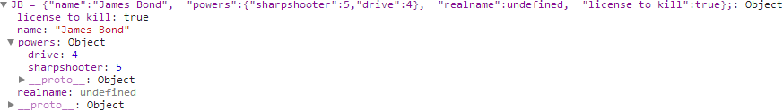

crap_json
=========

A crap JSON dumper for Erlang.  Takes some liberties.  Reasonably tested.


K what's this nonsense
----------------------

I needed a json dumper for a thing a friend and I were doing with [htstub](https://github.com/StoneCypher/htstub/).  It didn't have to be fancy.  It was export to JS only; no need to parse.  It did have to work reliably, to express JS primitives, to express nesting, and to work with international text.  I did not need the expression of Erlang exotic types like references and PIDs.

Thus (choral music) another piece o' crap was born.


Usage
=====

For detailed usage see the docs that I probably haven't written yet.

Text
----

```erlang
1> crap_json:to_json("a").
<<"\"a\"">>

2> crap_json:to_json("abc def").
<<"\"abc def\"">>

3> crap_json:to_json("abc \r \n def").
<<"\"abc \\r \\n def\"">>

4> crap_json:to_json("汉语").         
<<"\"\\u6C49\\u8BED\"">>
```

Numbers
-------

```erlang
5> crap_json:to_json(1).              
<<"1">>

6> crap_json:to_json(-1).
<<"-1">>

7> crap_json:to_json(-2.5).
<<"-2.5">>

8> crap_json:to_json(0.1).      % good handling of rounding error
<<"0.1">>
```

Atoms as JS keywords
--------------------

```erlang
9> crap_json:to_json(true).                                      
<<"true">>

10> crap_json:to_json(false).
<<"false">>

11> crap_json:to_json(null). 
<<"null">>
```

Proplists as Objects
--------------------

```erlang
12> io:format("~s~n", [crap_json:to_json( [ {"height", "2in"}, {"width", "3in"} ]) ]).
{"height":"2in","width":"3in"}

13> io:format("~s~n", [
  crap_json:to_json( [ 
    {"name","John Smith"}, 
    {"powers", [ 
      {"sharpshooter", 5}, 
      {"drive", 4} 
    ]}, 
    { "realname", undefined }, 
    { "license to kill", true } 
  ]) 
]). 
{"name":"John Smith","powers":{"sharpshooter":5,"drive":4},"realname":undefined,"license to kill":true}
```

... the latter of which Chrome Debugger parses thusly:



Tuples as Arrays
----------------

14> crap_json:to_json( {1,2,3} ).
<<"[1,2,3]">>

15> crap_json:to_json( {1, {2,3}, {true,false,null} } ).
<<"[1,[2,3],[true,false,null]]">>

Erlang e17 Maps
---------------

Haven't done these yet.


The Verdict
===========

Okay, so how's it look?

The Good
--------

* Reasonably well tested, including stochastic tests from PropEr
* Tolerably documented
* Adequate


The Bad
-------

* Dump only; no parse
* Probably could be a lot faster
* Not entirely finished as of this writing


The Ugly
--------

* Probably can't be made round-trip parse stable because of collisions like how binaries are handled
* Very new; may still have lurking bugs or dumb mistakes


Polemic :neckbeard:
===================

`crap_json` is MIT licensed, because viral licenses and newspeak language modification are evil.  Free is ***only*** free when it's free for everyone.
